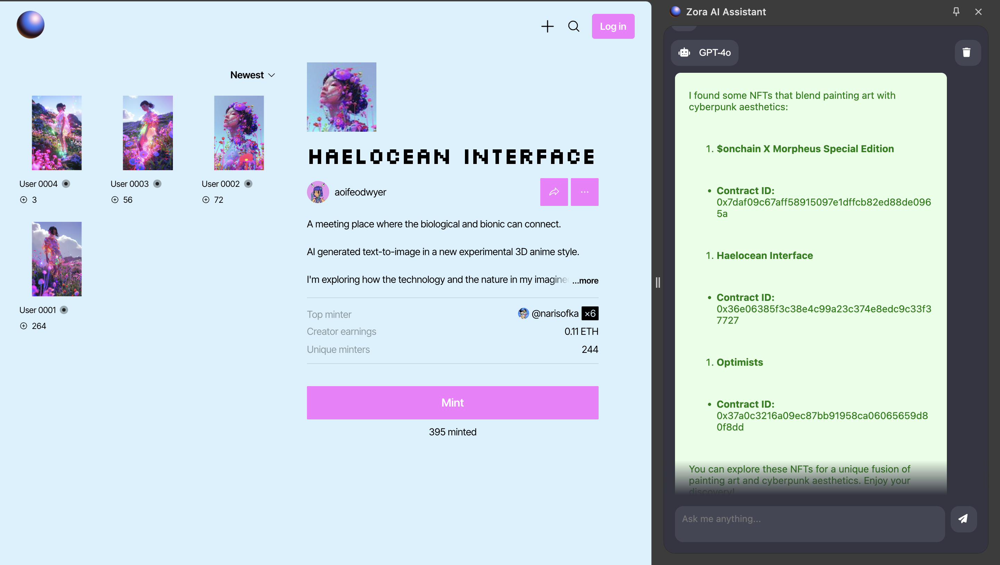
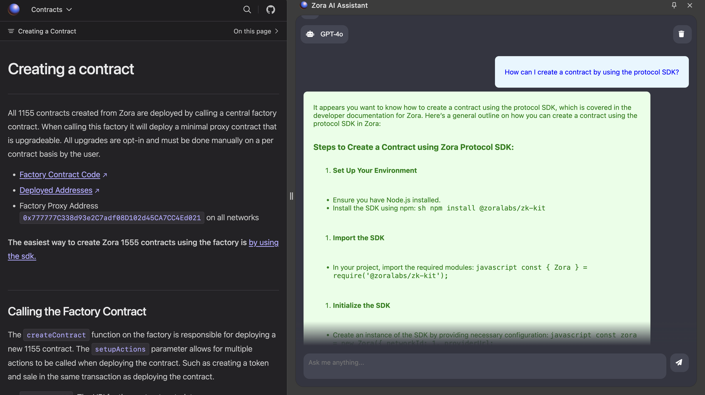

# ZoraAgent: AI-Powered Zora Assistant Chrome Extension

## Overview

ZoraAgent is an innovative Chrome extension designed to revolutionize the experience of discovering, collecting, and building NFTs with Zora. This AI-powered assistant leverages the Zora protocol documentation and has access to information about NFTs listed on Zora, providing users with intelligent insights and assistance throughout their NFT journey.

ZoraAgent addresses two critical issues in the NFT space:
1. The challenge of using Zora as a creator, where minting, creating contracts, and exploration can be complex.
2. The difficulty of semantically exploring NFTs on the blockchain, which often pushes people towards price-oriented exploration rather than focusing on creativity, context, and transmission.

## Features

- **Smart Discovery**: Intelligently recommends NFTs based on recent on-chain data, enabling semantic exploration of NFTs.
- **Collection Insights**: Provides detailed information and analytics about NFT collections on Zora.
- **Creation Assistance**: Offers guidance and tips for users looking to create their own NFTs on Zora, reducing the entry barrier for creators.
- **Protocol Documentation Access**: Quick and easy access to relevant Zora protocol documentation.
- **Zora SDK Guidance**: Explains how to use the Zora SDK for developers and creators.
- **Concept Explanation**: Clarifies blockchain and NFT concepts for users at all levels.
- **Semantic NFT Search**: Allows users to search for NFTs based on context and meaning, not just price.

## Installation

1. Clone this repository or download the source code.
2. Open Chrome and navigate to `chrome://extensions/`.
3. Enable "Developer mode" in the top right corner.
4. Click "Load unpacked" and select the directory containing the extension files.
5. The ZoraAgent icon should now appear in your Chrome toolbar.

## Usage

1. Click on the ZoraAgent icon in your Chrome toolbar to activate the extension.
2. Fill in your OpenAI API key by clicking the settings icon.
3. Use the chat interface to ask questions or request specific information about Zora NFTs or the protocol. You can:
   - Discover NFTs by asking the assistant to search for you
   - Get help on building with Zora Protocol
   - Ask for explanations of concepts
   - Seek guidance on using Zora or its SDK

ZoraAgent provides an interface to an extremely knowledgeable agent that understands Zora, blockchain, and NFTs. Users can engage in conversations with ZoraAgent and ask anything related to these topics.
